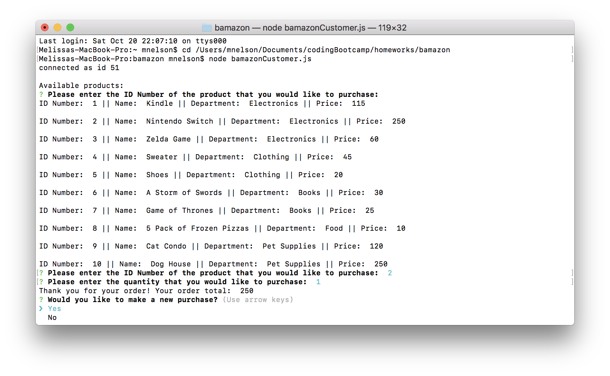
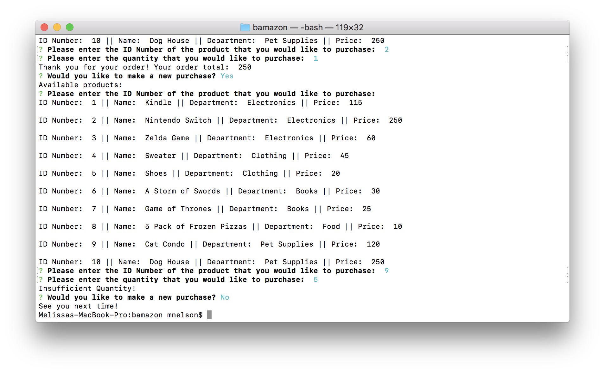
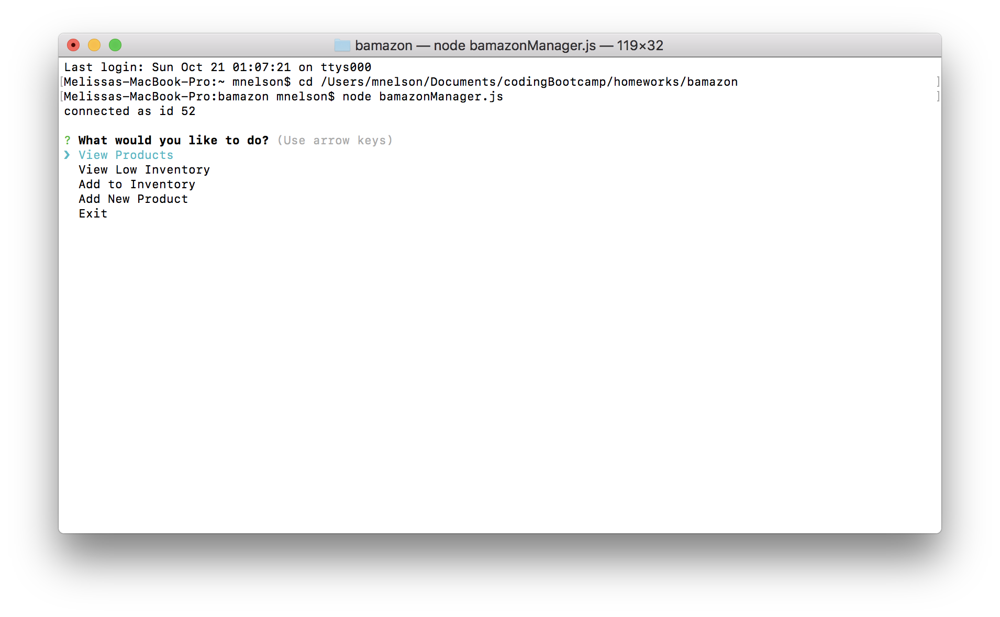
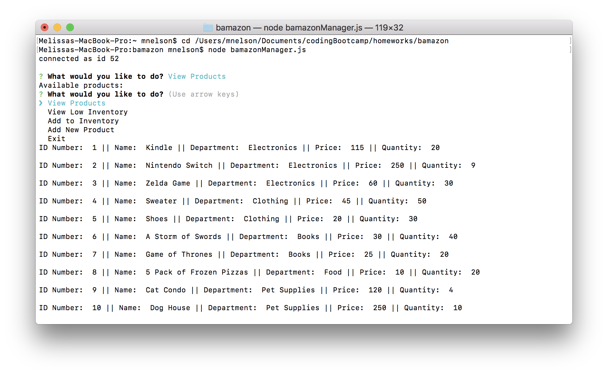
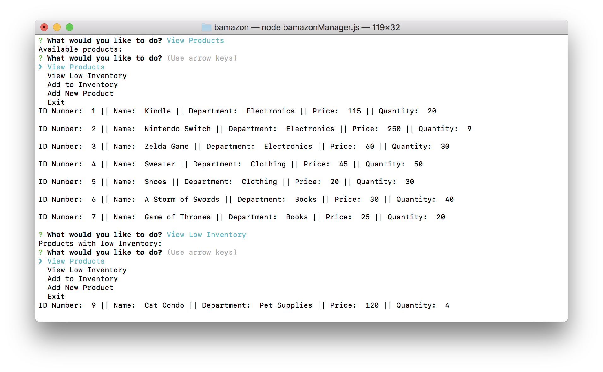
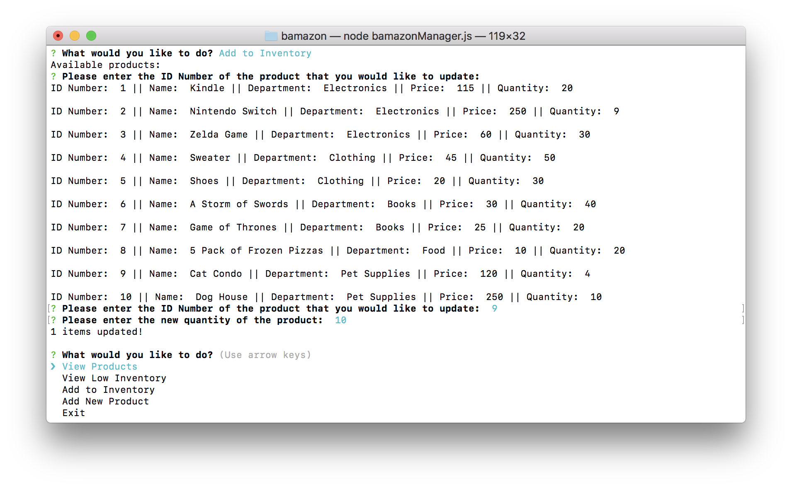
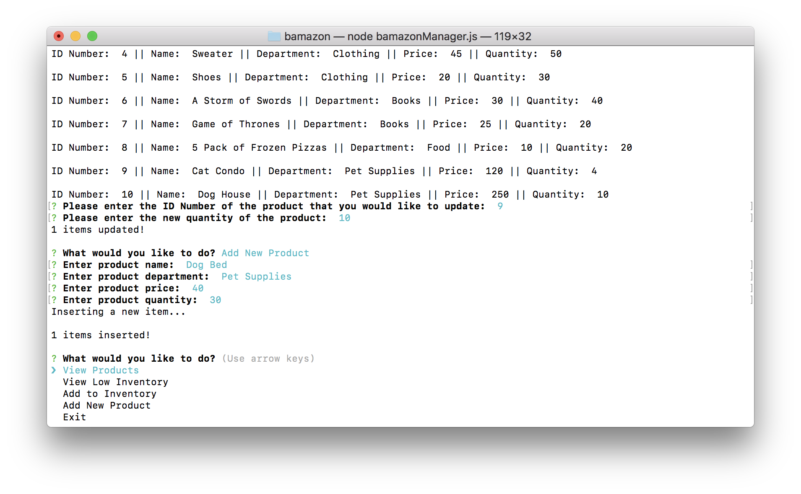
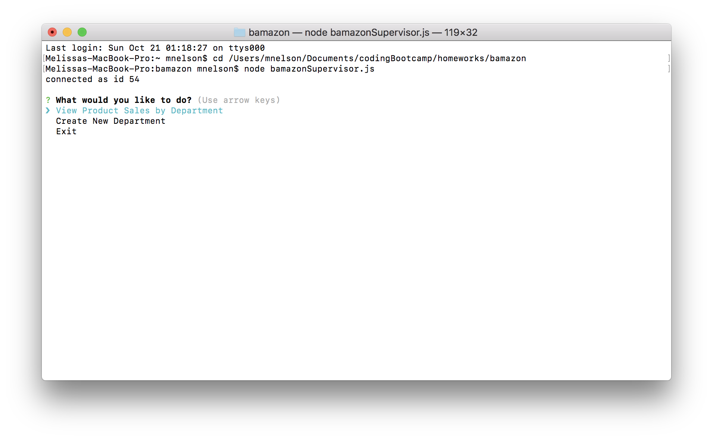
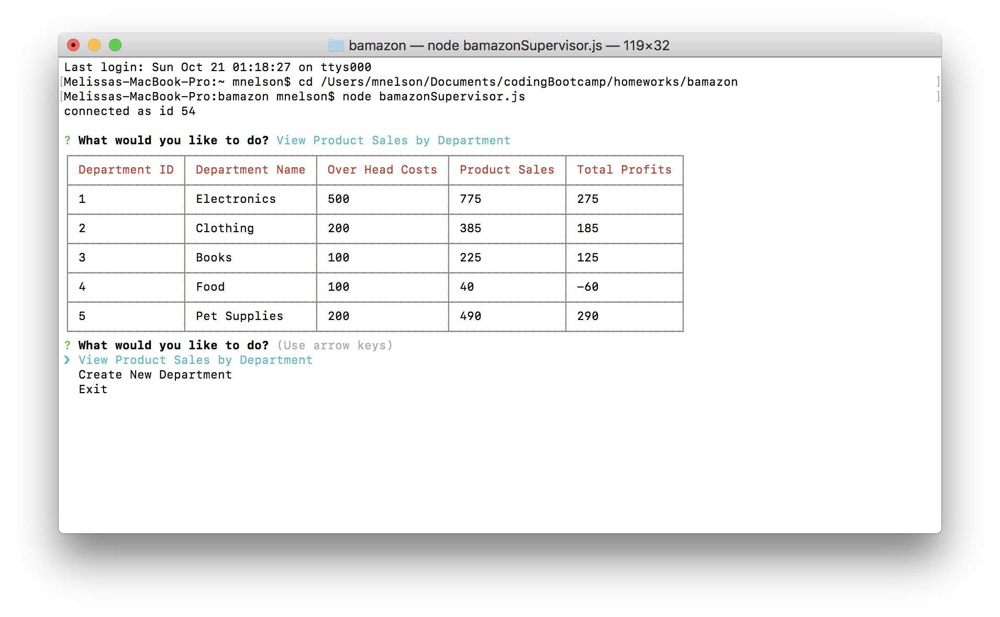
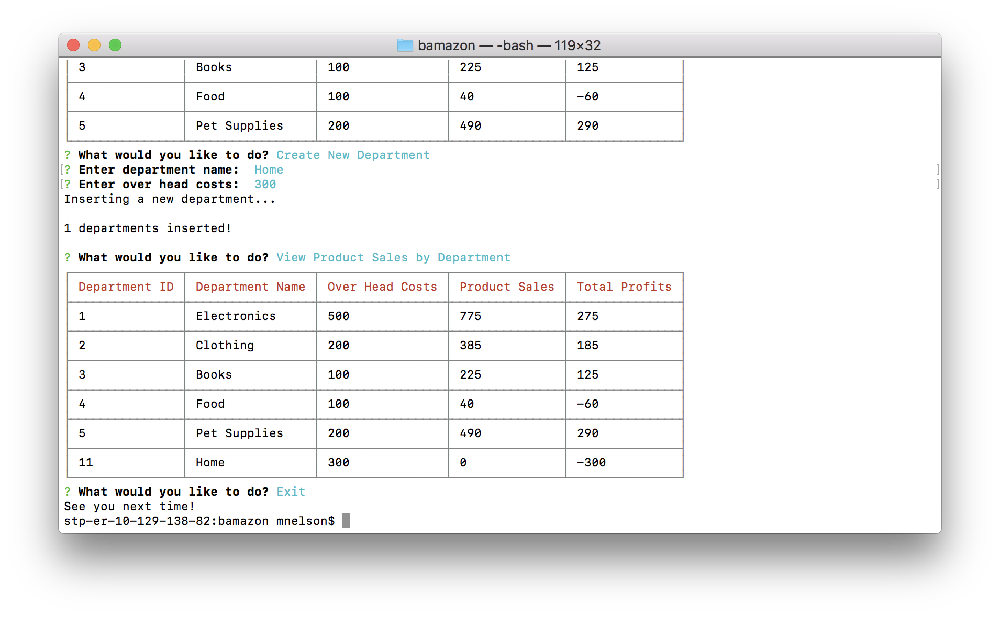

# Bamazon

### Features/Instructions:
* Bamazon is a CLI storefront app
* There are three different views: Customer View, Manager View, and Supervisor View
* Customer View:
    * In Customer View, you can view avaliable products and purchase products by specifying ID Number and quantity
    * If the store has enough product to meet the request, the app will show the order total, update the product's stock-quantity, and the product's sales
    
    * If the store does not have enough product to meet the request, "Insufficient quantity" will show
    
    * You will then be asked if you would like to make a new purchase
* Manager View:
    * In Manager View, you can view products, view low inventory, add to inventory, and add new products
    
    * Selecting "View Products" will show all products and their quantities
    
    * Selecting "View Low Inventory" will show any products that have a stock-quantity lower than 5
    
    * Selecting "Add to Inventory" will allow you to update an existing product's stock-quantity
    
    * Selecting "Add New Product" will allow you to add a completely new product
    
* Supervisor View
    * In Supervisor View, you can view costs, sales, and profits by department, as well as add new departments
    
    * Selecting "View Product Sales by Department" will show a table of all departments and their profits
    
    * Selecting "Create New Department" will allow you to add a new department
    

### Languages/Technologies Used:
* JavaScript, Node.js, MySQL, Command Line